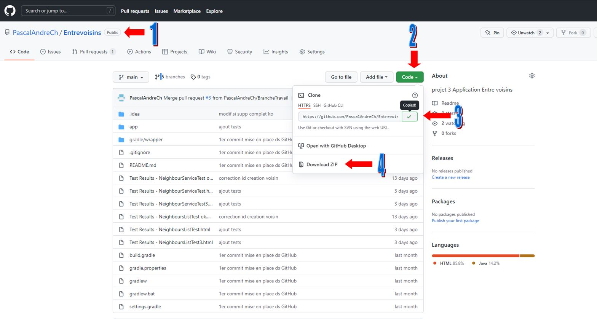
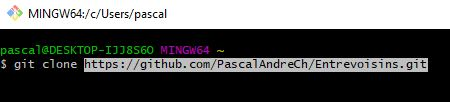
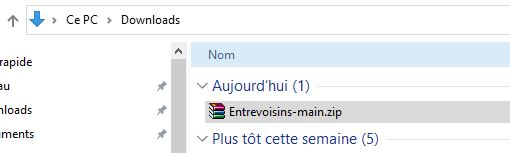
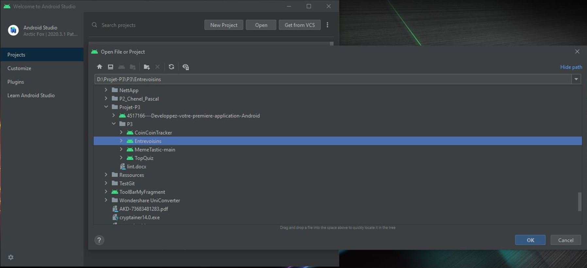
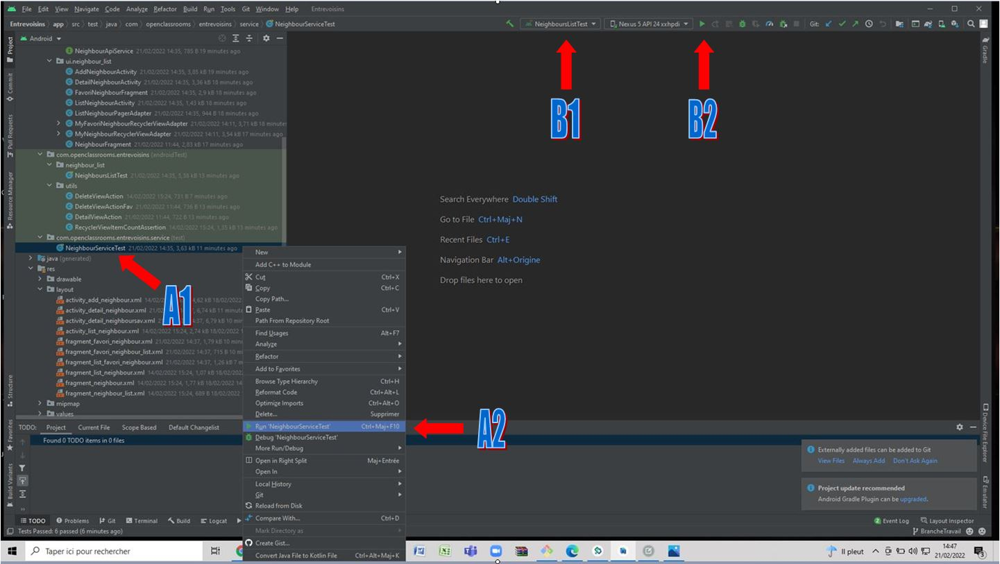
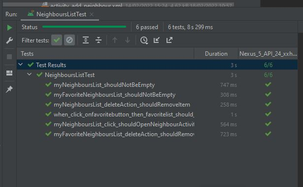
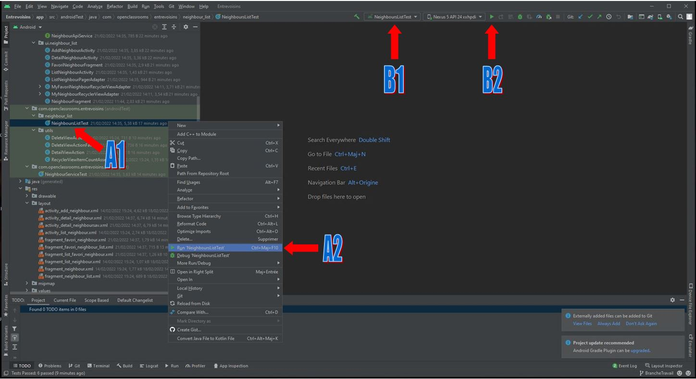
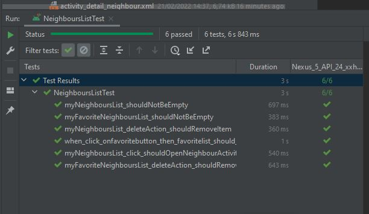
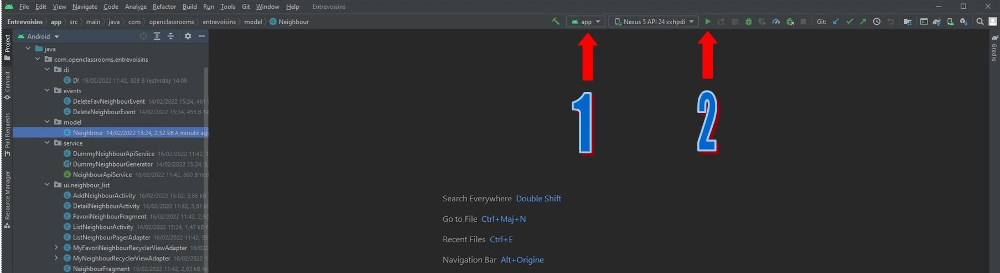

# OpenClassrooms

Ce dépôt contient une mini-application pour le P3 du parcours **Grande École du Numérique**.  

## Application **ENTREVOISINS**

### Description
Cette application permet je gérer une liste de voisins, contenant leur photo, nom, adresse, numéro de téléphone, lien facebook et une description les présentant. On peut y sélectionner nos voisins préférés.  

### Récupérer le projet Entrevoisins
- aller sur le repositorie PascalAndreCh/Entrevoisins (1)
- copier l'adresse du code ou télécharger le fichier Download.zip (2et3 ou 4)
 

Cloner le projet.  
  

Ou dézipper le fichier.  
  

**Ouvrir le projet dans Android Studio.**
  

Lancer les Tests unitaires. Sélectionner "NeighbourServiceTest" et cliquer sur RUN (A1 et A2, ou B1 et B2).  
   

Les Tests unitaires passent.
  

Lancer les tests instrumentés. Sélectionner "NeighbourListTest" et Cliquer sur RUN (A1 et A2, ou B1 et B2).
  

Les tests instrumentés passent.
  

Lancer l'application en sélectionnant APP et en cliquant sur RUN.
 

**Tester l'application, améliorez la**.
=
Vous trouverez dans le fichier Documentation.md un mode opératoire de cette application

