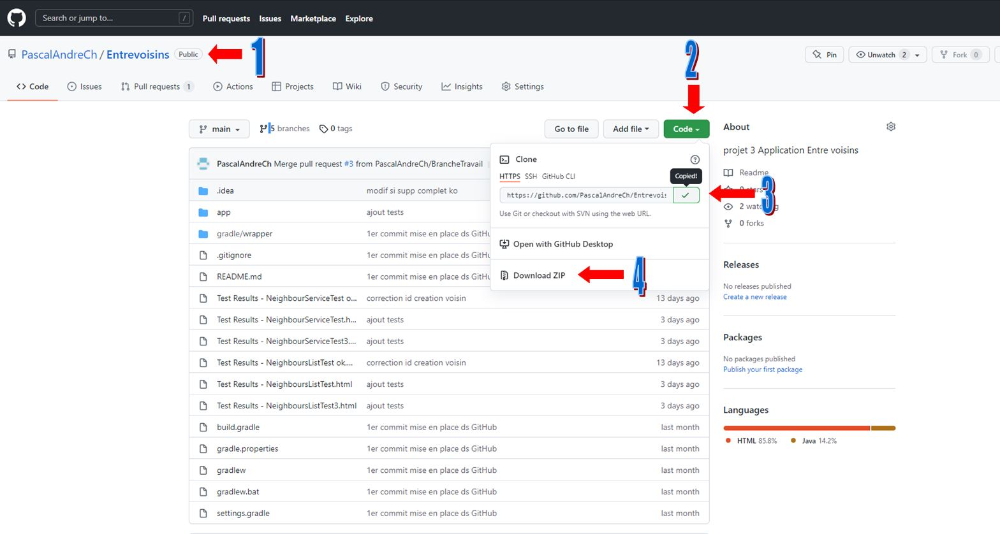

# OpenClassrooms

Ce dépôt contient une mini-application pour le P3 du parcours **Grande École du Numérique**.  

## Application **ENTREVOISINS**

### Description
Cette application permet je gérer une liste de voisins, contenant leur photo, nom, adresse, numéro de téléphone, lien facebook et une description les présentant. On peut y sélectionner nos voisins préférés.  

### Tour d'horizon de l'application
A l'ouverture de l'application, la liste des voisins déjà créés s'affiche dans l'onglet "My NEIGHBOURS".  
  

Un clic sur l'onglet "FAVORITES" fait apparaitre la liste des voisins préférés

Dans chacun des onglets, vous pouvez accéder au détail d'un voisin en cliquant sur celui-ci

Voisin Favori, étoile jaune. Voisin non favori, étoile blanche. Clic sur l'étoile pour modifier son status
  

Il est possible de modifier toutes les données. Ici, nous changeons le numéro de téléphone.
 

Vous pouvez rajouter ou supprimer des favoris. Caroline n'était pas dans les favoris, maintenant elle y est.  
 

Chloé est dans les favoris, son étoile est jaune. nous cliquons dessus.
  

Son étoile devient blanche.  

Chloé n'est plus dans la liste des favoris.  
  

Dans l'onglet "FAVORITES", un clic sur l'étoile jaune supprime immédiatement le voisin de cette liste de favoris.
Elodie vient d'être retirée de cette liste.  
  

Dans l'onglet "MY NEIGHBOURS", un clic sur la poubelle supprime le voisin du fichier. Si ce voisin est aussi
un favori, il sera également supprimé de cette liste.    
    

Une boite de dialogue apparait, vous pouvez soit confirmer la suppression, soit la refuser
 

En cas de refus, le message "abandon" s'affiche quelques secondes, sinon, le voisin est supprimé
 

Dans cet exemple, Dan a été supprimé.    
 

De ce fait, il n'est plus dans les favoris.  
 

Vous pouvez créer de nouveaux voisins en cliquant sur l'icone bleu, personnage blanc.
Un écran de création devient accessible.  
  

Renseigner les champs souhaités.  
  

Si aucun champs n'est renseigné, le bouton de sauvegarde n'est pas activé.  
  

Cliquer sur save pour sauvegarder, ou sur la flèche retour en haut à gauche pour abandonner.  
  

Vous revenez dans votre écran de départ. Ici, nous n'avons sauvegardé, Haroldy a été créé.  
  

### Récupérer le projet Entrevoisins
- aller sur le repositorie PascalAndreCh/Entrevoisins (1)
- copier l'adresse du code ou télécharger le fichier Download.zip (2et3 ou 4)
 

Cloner le projet.  
  

Ou déziper le fichier.  
  

Ouvrez le projet dans Android Studio.  
  

Lancer l'application en selectionnant APP et en cliquant sur RUN.
  

**Tester l'application, améliorez la**.

